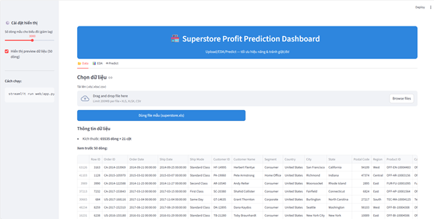

# 🧠 Superstore Profit Prediction Dashboard

## 📌 Giới thiệu
Dự án này phân tích dữ liệu **Superstore** và xây dựng mô hình **học máy (Machine Learning)** nhằm **dự đoán lợi nhuận (Profit)** dựa trên các yếu tố như doanh thu (Sales), chiết khấu (Discount), số lượng (Quantity), khu vực (Region), danh mục sản phẩm (Category), v.v.

Ứng dụng web được phát triển bằng **Streamlit**, cho phép:
- Tải lên dữ liệu Superstore mới hoặc dùng dữ liệu mẫu.  
- Trực quan hóa (EDA) bằng các biểu đồ tương tác.  
- So sánh các mô hình học máy khác nhau.  
- Dự đoán lợi nhuận trực tiếp từ giao diện web.

---

## 🏗️ Cấu trúc thư mục
```
📂 superstore-dashboard/
├── src/
│   ├── preprocessing.py          # Tiền xử lý dữ liệu
│   ├── feature_engineering.py    # Trích chọn đặc trưng
│   ├── model_training.py         # Huấn luyện mô hình
│   ├── evaluation.py             # Hàm đánh giá mô hình
│   ├── eda.py                    # Phân tích & vẽ biểu đồ
│   ├── main.py                   # Chạy huấn luyện toàn bộ pipeline
│   └── app.py                    # Giao diện web Streamlit
├── data/
│   └── superstore.xls            # Dữ liệu mẫu
├── requirements.txt
└── README.md
```

---

## ⚙️ Cài đặt môi trường
### 1️⃣ Cài thư viện
```bash
pip install -r requirements.txt
```

### 2️⃣ Huấn luyện mô hình
Chạy toàn bộ pipeline để huấn luyện và lưu mô hình tốt nhất:
```bash
python src/main.py
```

### 3️⃣ Chạy ứng dụng web
```bash
streamlit run src/app.py
```

---

## 📊 Mô hình và kết quả
Các mô hình được huấn luyện:
| Mô hình | R² | MAE | RMSE |
|----------|------|------|------|
| Linear Regression | 0.885 | 32.31 | 80.19 |
| Decision Tree | 0.953 | 22.47 | 51.46 |
| Random Forest | 0.983 | 14.30 | 31.12 |
| **XGBoost** | **0.983** | **15.45** | **30.82** |

🧩 **Mô hình tốt nhất:** `XGBoost`

---

## 🖥️ Ứng dụng Dashboard
Ứng dụng web gồm 3 tab chính:

| Tab | Chức năng |
|-----|------------|
| **📂 Data** | Tải dữ liệu hoặc xem mẫu Superstore |
| **📊 Phân tích (EDA)** | Biểu đồ doanh thu, lợi nhuận, vùng, danh mục |
| **🤖 Dự đoán (Predict)** | Nhập đầu vào và chọn mô hình để dự đoán Profit |



---

## 🚀 Công nghệ sử dụng
- **Python 3.10+**
- **Streamlit** – xây dựng giao diện web
- **Scikit-learn**, **XGBoost** – huấn luyện mô hình
- **Plotly**, **Seaborn**, **Matplotlib** – trực quan dữ liệu
- **Pandas**, **NumPy** – xử lý dữ liệu

---

## 📈 Kết luận
- Dự án đã xây dựng được quy trình **tiền xử lý → huấn luyện → đánh giá → triển khai web**.  
- Dashboard trực quan, dễ sử dụng, đáp ứng yêu cầu của giảng viên về phần “ứng dụng web ML”.  
- Mô hình **XGBoost** cho kết quả tốt nhất (R² ≈ 0.983).

---

